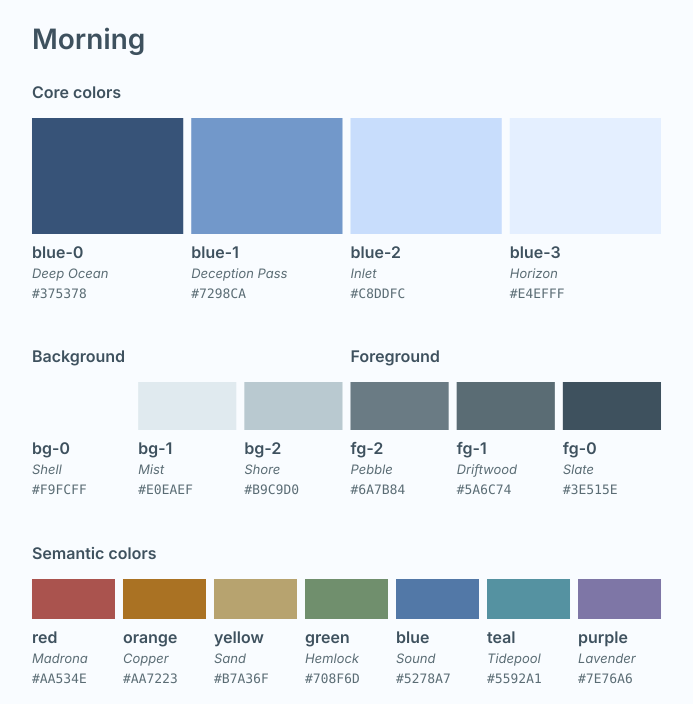
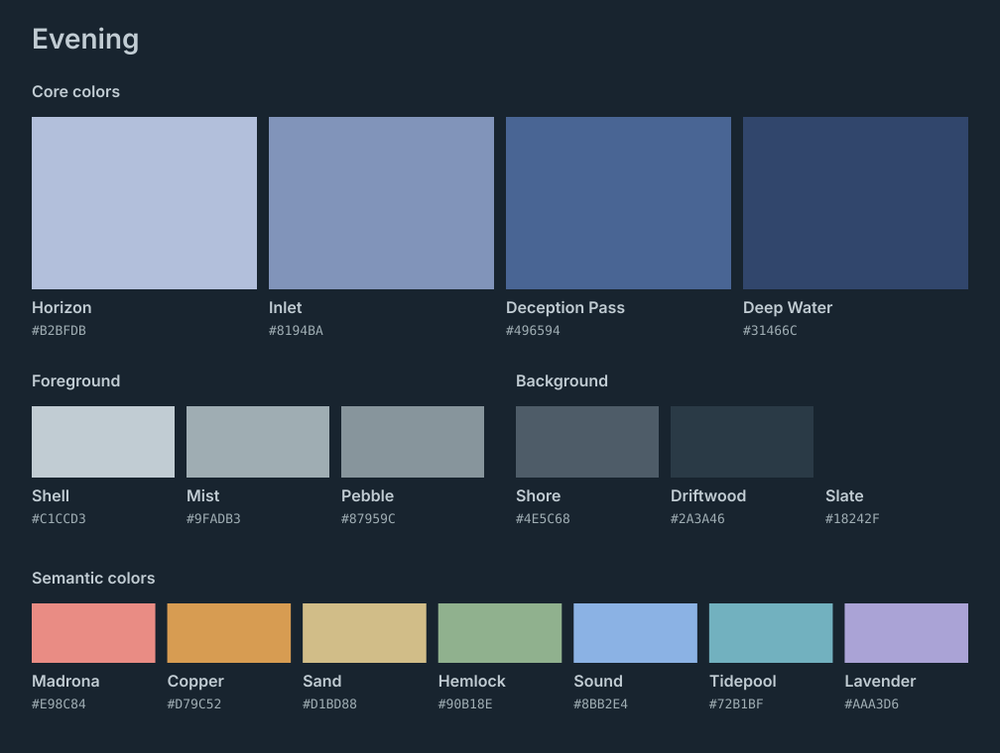

# Puget Sound

**A coastal palette for the tools you live in.**

Cool water, weathered wood, and a little shoreline warmth. 
Two expressions of the same colors: **Morning** and **Evening**.

[The palette](#the-palette) · [Applications](#applications) · [Design](#design)

 

## A familiar place, in different light

Puget Sound is a personal theme collection for **Helix, Pi, and WezTerm**. It brings a consistent visual language to an editor, a coding assistant, and a terminal—without requiring each application to use color in exactly the same way.

**Blues are the heart of Puget Sound.** They shape its interface, from broad selections and quiet layers to headings and fine borders. Foreground and background neutrals extend that cool atmosphere; restrained accents bring contrast where it is needed.

**Morning** opens into pale, airy blues and near-white surfaces. **Evening** gathers those blues into deeper, slightly indigo layers against blue-gray backgrounds.

Neither is a mechanical inversion of the other. They are companion palettes, tuned to feel related in different light.

## The palette

### Core colors

Four layered blues establish the theme’s character. Their names describe their perceptual lightness within each variant, since Morning and Evening intentionally reverse the scale. “Core” describes their central role without implying a traditional red/yellow/blue primary-color model.

| Token | Morning | Morning value | Evening | Evening value |
| :--- | :--- | :--- | :--- | :--- |
| `blue-0` | **Deep Water** | `#375378` | **Horizon** | `#B2BFDB` |
| `blue-1` | **Deception Pass** | `#7298CA` | **Inlet** | `#8194BA` |
| `blue-2` | **Inlet** | `#C8DDFC` | **Deception Pass** | `#496594` |
| `blue-3` | **Horizon** | `#E4EFFF` | **Deep Water** | `#31466C` |

### Foreground

| Color | Role | Morning | Evening |
| :--- | :--- | :--- | :--- |
| Token | Morning | Morning value | Evening | Evening value |
| :--- | :--- | :--- | :--- | :--- |
| `fg-0` | **Slate** | `#3E515E` | **Shell** | `#C1CCD3` |
| `fg-1` | **Driftwood** | `#5A6C74` | **Mist** | `#9FADB3` |
| `fg-2` | **Pebble** | `#6A7B84` | **Pebble** | `#87959C` |

### Background

| Color | Token | Morning | Evening |
| :--- | :--- | :--- | :--- |
| Token | Morning | Morning value | Evening | Evening value |
| :--- | :--- | :--- | :--- | :--- |
| `bg-0` | **Shell** | `#F9FCFF` | **Slate** | `#18242F` |
| `bg-1` | **Mist** | `#E0EAEF` | **Driftwood** | `#2A3A46` |
| `bg-2` | **Shore** | `#B9C9D0` | **Shore** | `#4E5C68` |

These descriptors follow the neutral lightness sequence within each variant. They are presentation names only; implementation tokens remain numbered (`fg-0`, `fg-1`, `fg-2`, and `bg-0`, `bg-1`, `bg-2`).

### Semantic colors

Seven complementary colors support syntax, diagnostics, and other semantic roles. **Sound** is the syntax and semantic blue, distinct from the four primary interface colors.

| Color | Morning | Evening |
| :--- | :--- | :--- |
| **Madrona** · red | `#AA534E` | `#E98C84` |
| **Copper** · orange | `#AA7223` | `#D79C52` |
| **Sand** · yellow | `#B7A36F` | `#D1BD88` |
| **Hemlock** · green | `#708F6D` | `#90B18E` |
| **Sound** · blue | `#5278A7` | `#8BB2E4` |
| **Tidepool** · teal | `#5592A1` | `#72B1BF` |
| **Lavender** · purple | `#7E76A6` | `#AAA3D6` |

Terminal ANSI colors include application-specific adjustments and derived bright variants. Token spelling varies by application; poetic names identify the swatches, while implementation keys describe their roles.

## Applications

Both variants are included for each application. The theme files are plain configuration files; no build step is required to use them.

| Application | Theme files |
| :--- | :--- |
| **Helix** | [Port guide](ports/helix/README.md) · [Morning](ports/helix/puget_sound_morning.toml) · [Evening](ports/helix/puget_sound_evening.toml) |
| **Pi** | [Port guide](ports/pi/README.md) · [Morning](ports/pi/puget-sound-morning.json) · [Evening](ports/pi/puget-sound-evening.json) |
| **WezTerm** | [Port guide](ports/wezterm/README.md) · [Both schemes](ports/wezterm/puget_sound_theme.lua) |

Installation and application-specific details live in each [port guide](#applications).
## Design

- **Related, not inverted.** Morning and Evening preserve the identity of the semantic colors while adjusting their perceptual lightness.
- **Blue comes first.** The core interface scale carries the atmosphere, with its own Evening treatment; semantic colors retain their distinct hues.
- **Adapt to the application.** Terminal brights and tool-specific surfaces serve their local roles while staying within the palette’s character.

Palette previews are generated from the shared JSON palette with `python3 scripts/render-palettes.py`. The shared JSON uses four role-based groups: `core`, `foreground`, `background`, and `semantic`.

## Growing the collection

This is a personal collection, with the three applications I use as its starting point. Additional ports can build on the same named palette and Morning/Evening relationship.

See [the proposed repository structure](docs/repository-structure.md) for an approach to adding applications, shared palette data, previews, and validation without mixing application-specific details into the core colors.
